# 🧠 AI Infra

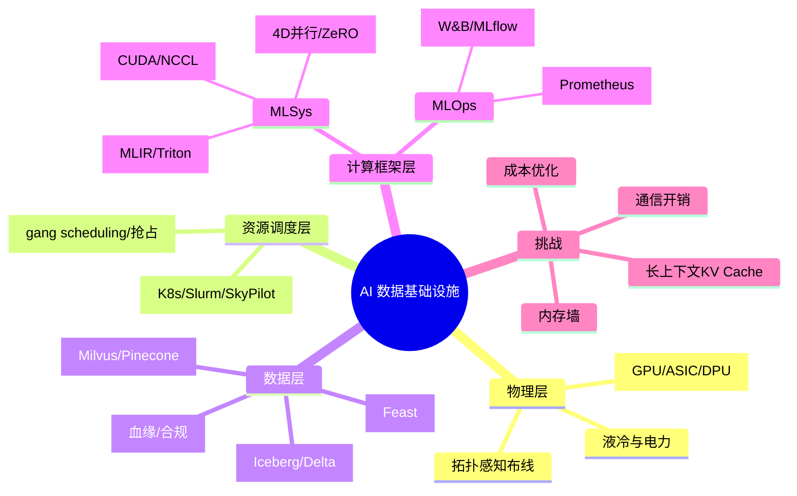
```mermaid
mindmap
  root((AI 数据基础设施))
    物理层
      计算节点[GPU/ASIC/DPU]
      液冷与电力
      拓扑感知布线
    资源调度层
      编排[K8s/Slurm/SkyPilot]
      策略[ gang scheduling/抢占 ]
    数据层
      湖仓[Iceberg/Delta]
      向量库[Milvus/Pinecone]
      特征平台[Feast]
      安全[血缘/合规]
    计算框架层
      MLSys
        编译器[MLIR/Triton]
        运行时[CUDA/NCCL]
        并行策略[4D并行/ZeRO]
      MLOps
        实验管理[W&B/MLflow]
        监控[Prometheus]
    挑战
      内存墙
      长上下文KV Cache
      通信开销
      成本优化 
```

## 计算资源

总览

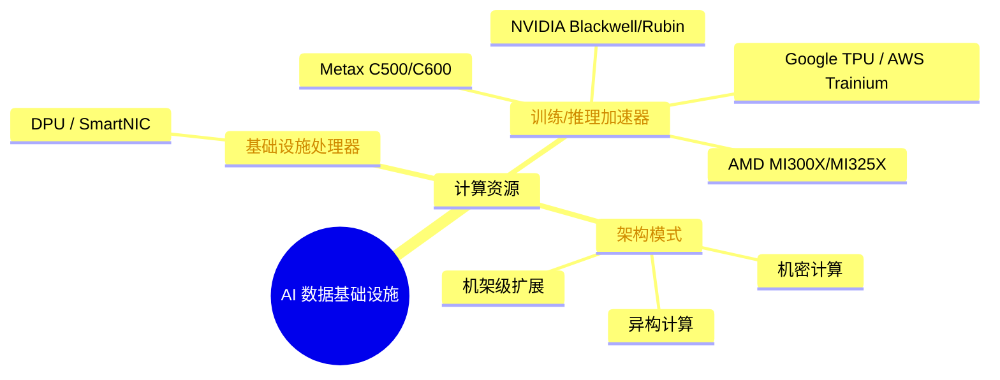
```mermaid
mindmap
  root((AI 数据基础设施))
    计算资源
      <span style="color:#d08b00">训练/推理加速器</span>
        NVIDIA Blackwell/Rubin
        AMD MI300X/MI325X
        Google TPU / AWS Trainium
        Metax C500/C600
      <span style="color:#d08b00">架构模式</span>
        机架级扩展
        机密计算
        异构计算
      <span style="color:#d08b00">基础设施处理器</span>
        DPU / SmartNIC
```

## 数据存储层

总览

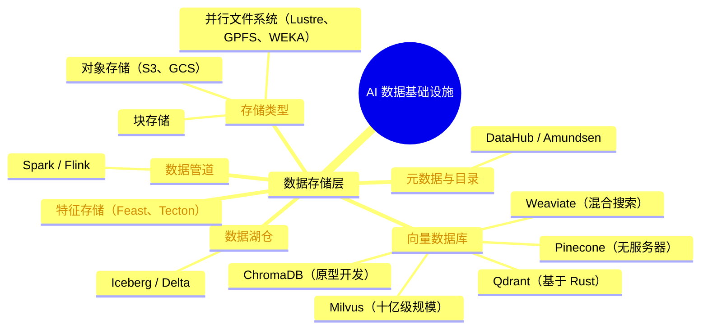
```mermaid
mindmap
  root((AI 数据基础设施))
    数据存储层
      <span style="color:#d08b00">存储类型</span>
        对象存储（S3、GCS）
        并行文件系统（Lustre、GPFS、WEKA）
        块存储
      <span style="color:#d08b00">数据湖仓</span>
        Iceberg / Delta
      <span style="color:#d08b00">数据管道</span>
        Spark / Flink
      <span style="color:#d08b00">元数据与目录</span>
        DataHub / Amundsen
      <span style="color:#d08b00">向量数据库</span>
        Pinecone（无服务器）
        Milvus（十亿级规模）
        Weaviate（混合搜索）
        Qdrant（基于 Rust）
        ChromaDB（原型开发）
      <span style="color:#d08b00">特征存储（Feast、Tecton）</span>
```

## 网络基础设施

总览

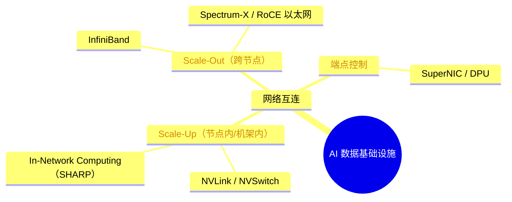
```mermaid
mindmap
  root((AI 数据基础设施))
    网络互连
      <span style="color:#d08b00">Scale-Up（节点内/机架内）</span>
        NVLink / NVSwitch
        In-Network Computing（SHARP）
      <span style="color:#d08b00">Scale-Out（跨节点）</span>
        InfiniBand
        Spectrum-X / RoCE 以太网
      <span style="color:#d08b00">端点控制</span>
        SuperNIC / DPU
```

## 编排与调度

总览

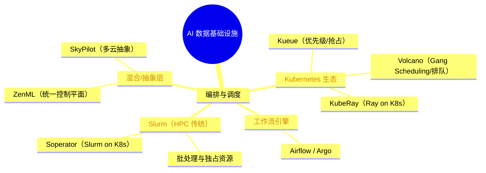
```mermaid
mindmap
  root((AI 数据基础设施))
    编排与调度
      <span style="color:#d08b00">Kubernetes 生态</span>
        KubeRay（Ray on K8s）
        Volcano（Gang Scheduling/排队）
        Kueue（优先级/抢占）
      <span style="color:#d08b00">Slurm（HPC 传统）</span>
        批处理与独占资源
        Soperator（Slurm on K8s）
      <span style="color:#d08b00">混合/抽象层</span>
        SkyPilot（多云抽象）
        ZenML（统一控制平面）
      <span style="color:#d08b00">工作流引擎</span>
        Airflow / Argo
```

## MLSys

总览

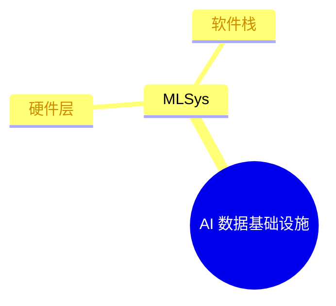
```mermaid
mindmap
  root((AI 数据基础设施))
    MLSys
      <span style="color:#d08b00">硬件层</span>
      <span style="color:#d08b00">软件栈</span>
```

硬件层

总览

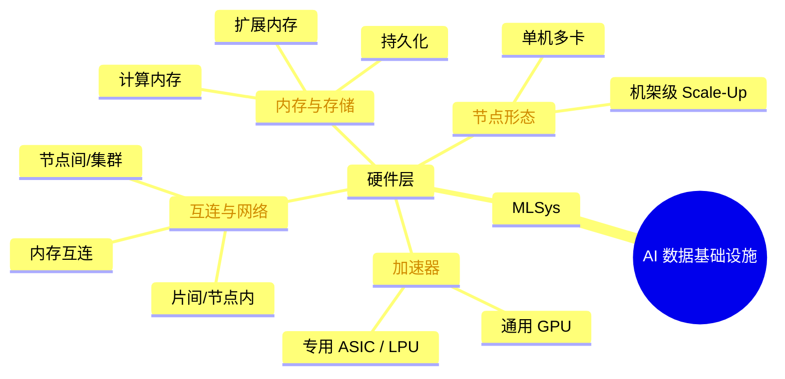
```mermaid
mindmap
  root((AI 数据基础设施))
    MLSys
      硬件层
        <span style="color:#d08b00">加速器</span>
          通用 GPU
          专用 ASIC / LPU
        <span style="color:#d08b00">互连与网络</span>
          片间/节点内
          节点间/集群
          内存互连
        <span style="color:#d08b00">内存与存储</span>
          计算内存
          扩展内存
          持久化
        <span style="color:#d08b00">节点形态</span>
          单机多卡
          机架级 Scale-Up
```

加速器

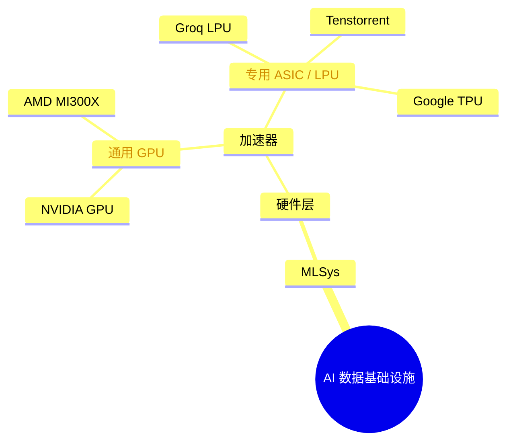
```mermaid
mindmap
  root((AI 数据基础设施))
    MLSys
      硬件层
        加速器
          <span style="color:#d08b00">通用 GPU</span>
            NVIDIA GPU
            AMD MI300X
          <span style="color:#d08b00">专用 ASIC / LPU</span>
            Groq LPU
            Tenstorrent
            Google TPU
```

互连与网络

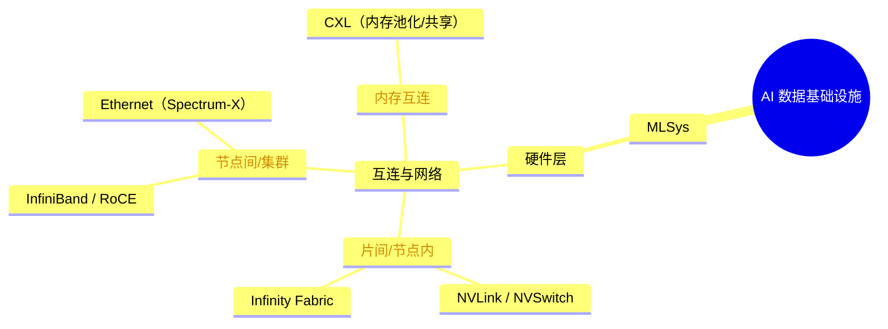
```mermaid
mindmap
  root((AI 数据基础设施))
    MLSys
      硬件层
        互连与网络
          <span style="color:#d08b00">片间/节点内</span>
            NVLink / NVSwitch
            Infinity Fabric
          <span style="color:#d08b00">节点间/集群</span>
            InfiniBand / RoCE
            Ethernet（Spectrum-X）
          <span style="color:#d08b00">内存互连</span>
            CXL（内存池化/共享）
```

内存与存储

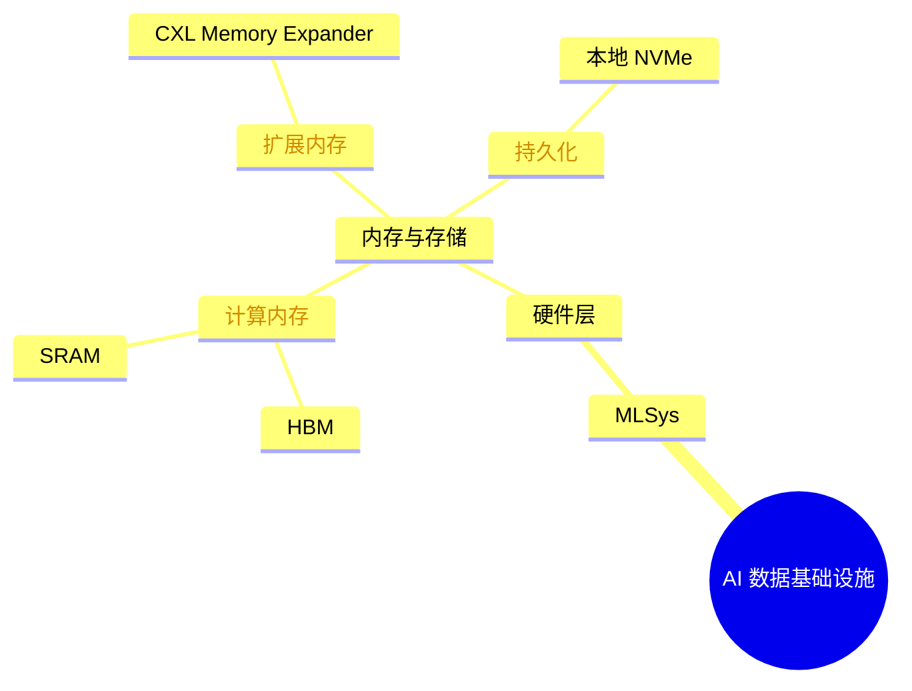
```mermaid
mindmap
  root((AI 数据基础设施))
    MLSys
      硬件层
        内存与存储
          <span style="color:#d08b00">计算内存</span>
            HBM
            SRAM
          <span style="color:#d08b00">扩展内存</span>
            CXL Memory Expander
          <span style="color:#d08b00">持久化</span>
            本地 NVMe
```

节点形态

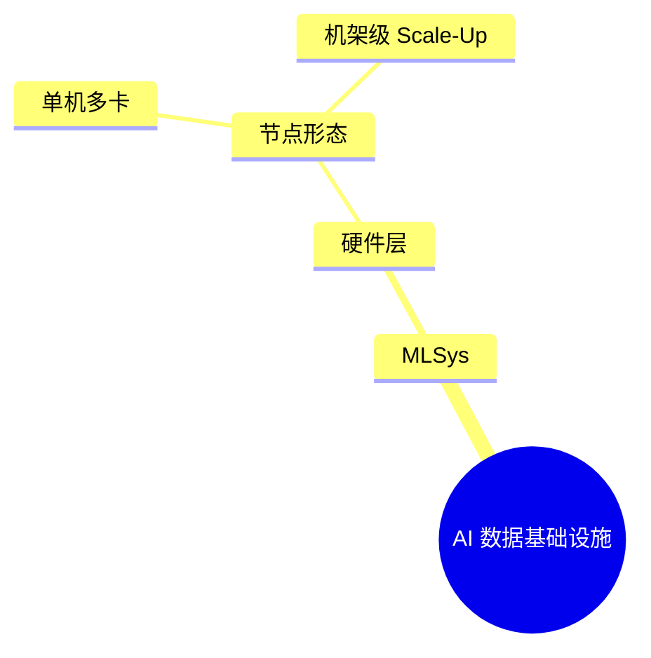
```mermaid
mindmap
  root((AI 数据基础设施))
    MLSys
      硬件层
        节点形态
          单机多卡
          机架级 Scale-Up
```

软件栈

总览

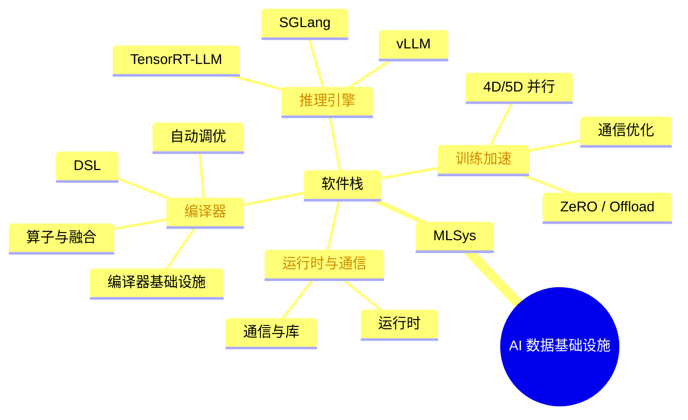
```mermaid
mindmap
  root((AI 数据基础设施))
    MLSys
      软件栈
        <span style="color:#d08b00">运行时与通信</span>
          运行时
          通信与库
        <span style="color:#d08b00">编译器</span>
          编译器基础设施
          DSL
          算子与融合
          自动调优
        <span style="color:#d08b00">推理引擎</span>
          vLLM
          SGLang
          TensorRT-LLM
        <span style="color:#d08b00">训练加速</span>
          4D/5D 并行
          ZeRO / Offload
          通信优化
```

运行时与通信

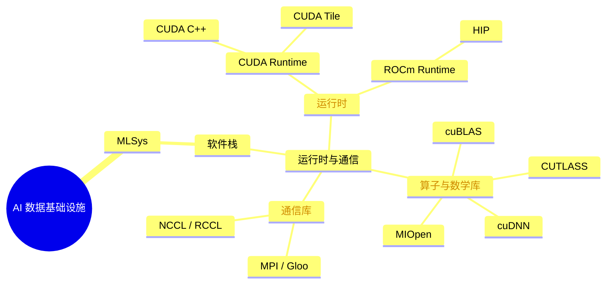
```mermaid
mindmap
  root((AI 数据基础设施))
    MLSys
      软件栈
        运行时与通信
          <span style="color:#d08b00">运行时</span>
            CUDA Runtime
              CUDA C++
              CUDA Tile
            ROCm Runtime
              HIP
          <span style="color:#d08b00">算子与数学库</span>
            cuBLAS
            cuDNN
            CUTLASS
            MIOpen
          <span style="color:#d08b00">通信库</span>
            NCCL / RCCL
            MPI / Gloo
```

编译器

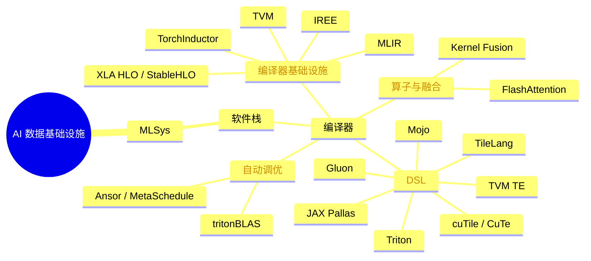
```mermaid
mindmap
  root((AI 数据基础设施))
    MLSys
      软件栈
        编译器
          <span style="color:#d08b00">编译器基础设施</span>
            MLIR
            TVM
            XLA HLO / StableHLO
            IREE
            TorchInductor
          <span style="color:#d08b00">DSL</span>
            Triton
            Gluon
            TileLang
            cuTile / CuTe
            TVM TE
            Mojo
            JAX Pallas
          <span style="color:#d08b00">算子与融合</span>
            FlashAttention
            Kernel Fusion
          <span style="color:#d08b00">自动调优</span>
            Ansor / MetaSchedule
            tritonBLAS
```

编译器 · 基础设施

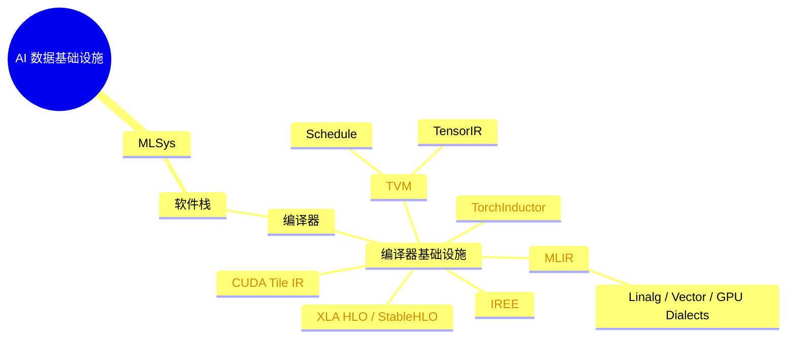
```mermaid
mindmap
  root((AI 数据基础设施))
    MLSys
      软件栈
        编译器
          编译器基础设施
            <span style="color:#d08b00">MLIR</span>
              Linalg / Vector / GPU Dialects
            <span style="color:#d08b00">TVM</span>
              TensorIR
              Schedule
            <span style="color:#d08b00">XLA HLO / StableHLO</span>
            <span style="color:#d08b00">IREE</span>
            <span style="color:#d08b00">TorchInductor</span>
            <span style="color:#d08b00">CUDA Tile IR</span>
```

编译器 · DSL

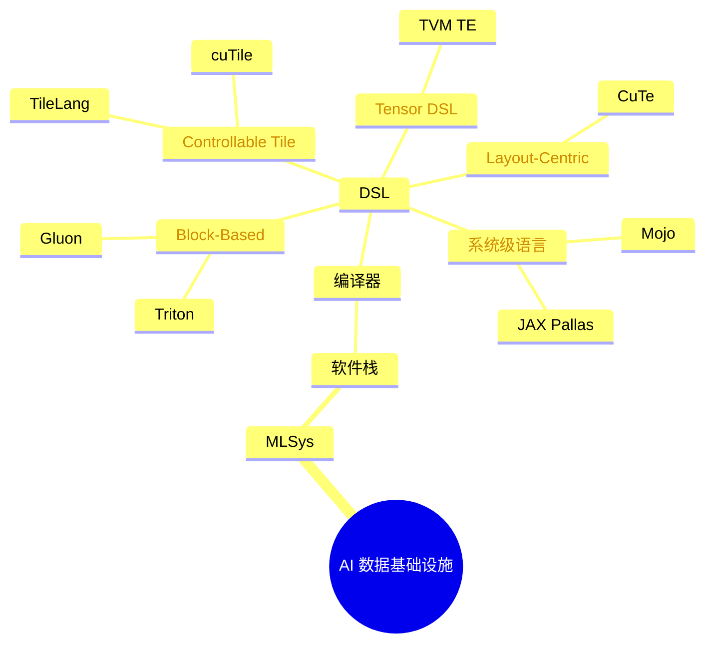
```mermaid
mindmap
  root((AI 数据基础设施))
    MLSys
      软件栈
        编译器
          DSL
            <span style="color:#d08b00">Block-Based</span>
              Triton
              Gluon
            <span style="color:#d08b00">Controllable Tile</span>
              TileLang
              cuTile
            <span style="color:#d08b00">Layout-Centric</span>
              CuTe
            <span style="color:#d08b00">Tensor DSL</span>
              TVM TE
            <span style="color:#d08b00">系统级语言</span>
              Mojo
              JAX Pallas
```

推理引擎

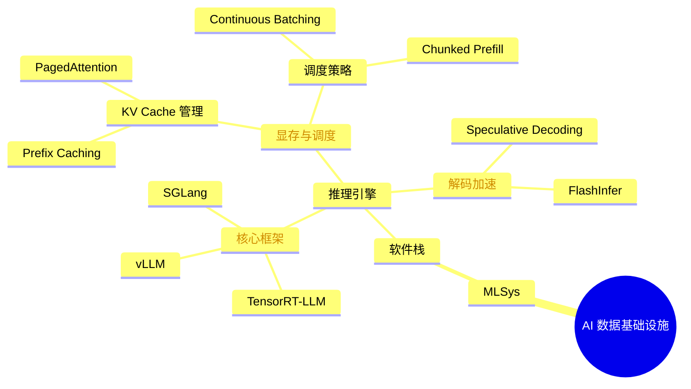
```mermaid
mindmap
  root((AI 数据基础设施))
    MLSys
      软件栈
        推理引擎
          <span style="color:#d08b00">核心框架</span>
            vLLM
            SGLang
            TensorRT-LLM
          <span style="color:#d08b00">显存与调度</span>
            KV Cache 管理
              PagedAttention
              Prefix Caching
            调度策略
              Continuous Batching
              Chunked Prefill
          <span style="color:#d08b00">解码加速</span>
            Speculative Decoding
            FlashInfer
```

训练加速

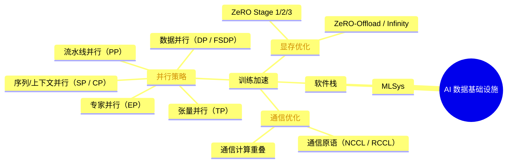
```mermaid
mindmap
  root((AI 数据基础设施))
    MLSys
      软件栈
        训练加速
          <span style="color:#d08b00">并行策略</span>
            数据并行（DP / FSDP）
            张量并行（TP）
            流水线并行（PP）
            序列/上下文并行（SP / CP）
            专家并行（EP）
          <span style="color:#d08b00">显存优化</span>
            ZeRO Stage 1/2/3
            ZeRO-Offload / Infinity
          <span style="color:#d08b00">通信优化</span>
            通信计算重叠
            通信原语（NCCL / RCCL）
```

## MLOps

总览

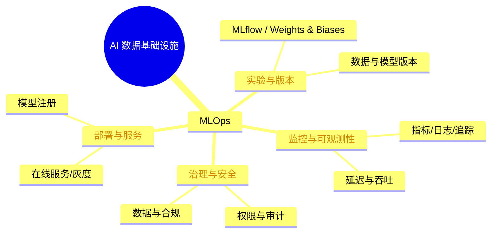
```mermaid
mindmap
  root((AI 数据基础设施))
    MLOps
      <span style="color:#d08b00">实验与版本</span>
        MLflow / Weights & Biases
        数据与模型版本
      <span style="color:#d08b00">监控与可观测性</span>
        指标/日志/追踪
        延迟与吞吐
      <span style="color:#d08b00">部署与服务</span>
        模型注册
        在线服务/灰度
      <span style="color:#d08b00">治理与安全</span>
        权限与审计
        数据与合规
```

## 物理基础设施

总览

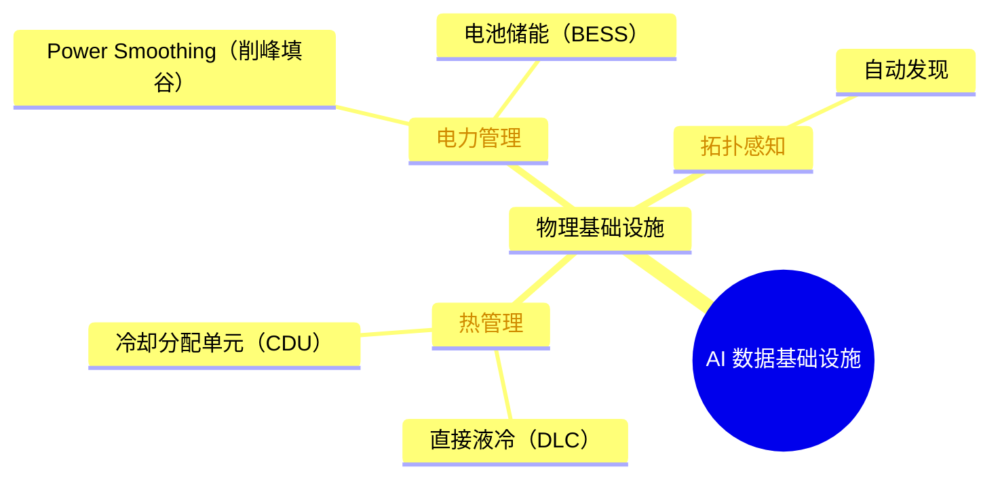
```mermaid
mindmap
  root((AI 数据基础设施))
    物理基础设施
      <span style="color:#d08b00">热管理</span>
        直接液冷（DLC）
        冷却分配单元（CDU）
      <span style="color:#d08b00">电力管理</span>
        Power Smoothing（削峰填谷）
        电池储能（BESS）
      <span style="color:#d08b00">拓扑感知</span>
        自动发现
```

## 核心挑战

总览

```mermaid
mindmap
  root((AI 数据基础设施))
    核心挑战
      <span style="color:#d08b00">算力利用率（Goodput vs Throughput）</span>
      <span style="color:#d08b00">内存墙（HBM 带宽瓶颈）</span>
      <span style="color:#d08b00">寄生能耗（非计算能耗占比）</span>
      <span style="color:#d08b00">长上下文推理（KV Cache 显存压力）</span>
      <span style="color:#d08b00">分布式通信开销</span>
```

---
